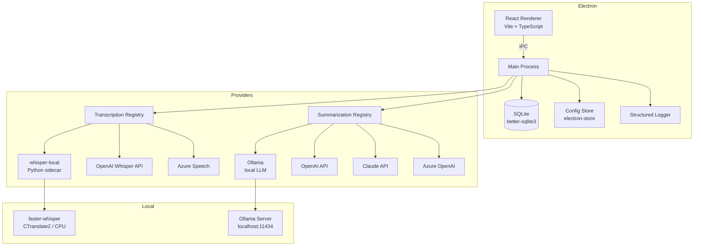

# Architecture

## Overview



## Components

### Electron Main Process (`src/main/index.ts`)
The main process owns all privileged operations: file system access, database queries, subprocess management, and provider API calls. It exposes functionality to the renderer exclusively through validated IPC handlers.

### React Renderer (`src/renderer/`)
The frontend is a React + TypeScript SPA built with Vite. It communicates with the main process through the `window.api` bridge exposed via `contextBridge` in the preload script. The renderer has no direct access to Node.js APIs, the file system, or native modules.

### SQLite Database (`src/main/storage/db.ts`)
Meeting data is stored in a local SQLite database at `%LOCALAPPDATA%\Rekal\meetings.db` using `better-sqlite3`. The database uses WAL journal mode for concurrent read performance. Tables:
- `meetings` -- recordings, transcripts, notes, bookmarks
- `chat_messages` -- per-meeting chat history

### Config Store (`src/main/config/store.ts`)
Application configuration and API keys are stored via `electron-store` with encryption. The config includes provider selections, model preferences, language settings, and API credentials.

### Structured Logger (`src/main/logging/logger.ts`)
JSON-line logger that writes to `%LOCALAPPDATA%\Rekal\logs\app.log`. Features auto-rotation (5MB max, 3 files kept) and automatic redaction of sensitive fields (API keys, tokens, passwords).

### Provider System (`src/main/providers/`)
A pluggable registry pattern that decouples the app from specific AI services.

## Provider Architecture

The provider system is built around two interfaces and a central registry:

```
ProviderRegistry
  transcription: Map<id, TranscriptionProvider>
  summarization: Map<id, SummarizationProvider>
```

**Transcription Providers:**
| ID | Name | Network | Notes |
|----|------|---------|-------|
| `whisper-local` | Local Whisper | None | Python sidecar, faster-whisper, CPU inference |
| `openai-whisper` | OpenAI Whisper API | OpenAI | Requires API key, uploads audio |
| `azure-speech` | Azure Speech | Azure | Requires key + region |

**Summarization Providers:**
| ID | Name | Network | Notes |
|----|------|---------|-------|
| `ollama` | Ollama | localhost | User picks model, fully local |
| `openai` | OpenAI | OpenAI | GPT models, requires API key |
| `claude` | Claude | Anthropic | Claude models, requires API key |
| `azure-openai` | Azure OpenAI | Azure | Requires key + endpoint + deployment |

Providers are registered at startup in `src/main/providers/index.ts`. Each provider implements `listModels()`, `validateConfig()`, and the core operation (`transcribe()` or `summarize()`).

## Data Flow

1. **Audio Recording**: The renderer uses the MediaRecorder API (WASAPI loopback + microphone) to capture audio. The raw audio data is sent to the main process via IPC, which saves it as a WAV file in `%LOCALAPPDATA%\Rekal\recordings\`.

2. **Transcription**: The WAV file path is passed to the selected transcription provider. For `whisper-local`, this spawns the Python faster-whisper sidecar which returns a JSON transcript with timestamped segments. Cloud providers upload the audio and return the same format.

3. **Summarization**: The transcript JSON is passed to the selected summarization provider, which generates structured meeting notes (summary, action items, key decisions, topics). Progress is streamed back to the renderer.

4. **Storage**: The complete meeting record (audio path, transcript, notes, bookmarks) is saved to the SQLite database.

5. **Export**: Meetings can be exported as Markdown or emailed via the system mail client (`mailto:` links).

## Security Model

- **Context Isolation**: The renderer runs in a sandboxed environment with `contextIsolation: true`, `nodeIntegration: false`, and `sandbox: true`. All main process access goes through the preload script's `contextBridge`.
- **Content Security Policy**: CSP headers restrict script sources to `'self'`, limit network connections to known provider domains and localhost, and prevent inline script execution.
- **Input Validation**: IPC handlers validate argument types and check for path traversal before processing.
- **Credential Protection**: API keys are stored encrypted and automatically redacted from logs.
- **Local-First**: No data leaves the machine unless the user explicitly configures a cloud provider.
